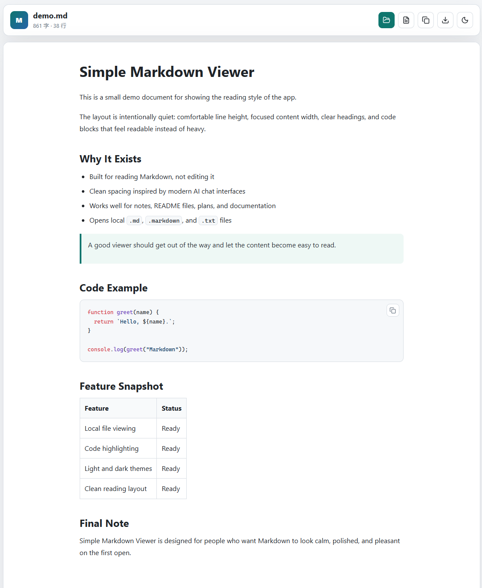

# Simple Markdown Viewer

A lightweight Markdown viewer focused entirely on reading experience.

This project was created after trying many Markdown viewers and realizing that most of them suffer from the same problems:

* Too many features that are rarely used
* Cluttered and distracting interfaces
* Poor typography and reading comfort
* Overly complex layouts
* Designed more like editors than readers

What I really wanted was simple:

A Markdown viewer that feels pleasant to read.

Inspired by the clean and comfortable reading experience of modern AI chat interfaces, this project focuses on typography, spacing, readability, and content presentation.

## Philosophy

Markdown is ultimately about content.

When reading documentation, notes, design proposals, project plans, or AI-generated content, the focus should be on the information itself—not on the tool displaying it.

This project follows a simple principle:

> The interface should disappear, allowing the content to take center stage.

## Features

* Clean and minimalist interface
* Excellent reading-focused typography
* Beautiful code block rendering
* Comfortable spacing and layout
* Optimized for long-form reading
* Light and dark theme support
* Fast local Markdown file viewing
* No unnecessary complexity
* No feature bloat

## Ideal For

* Project documentation
* Technical notes
* Knowledge bases
* README files
* AI-generated content
* Personal notes
* Offline Markdown reading

## Design Goals

* Readability first
* Minimal distractions
* Beautiful typography
* Consistent visual hierarchy
* Fast and lightweight
* Content-focused experience

## Why Another Markdown Viewer?

Because sometimes the best tool is the one that stays out of your way.

Simple Markdown Viewer is built for people who spend more time reading Markdown than editing it.

**A Markdown Viewer designed for reading, not editing.**
